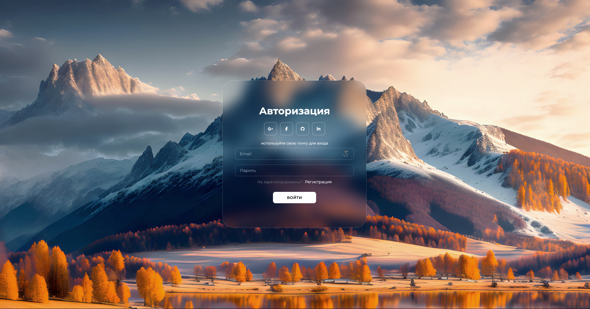
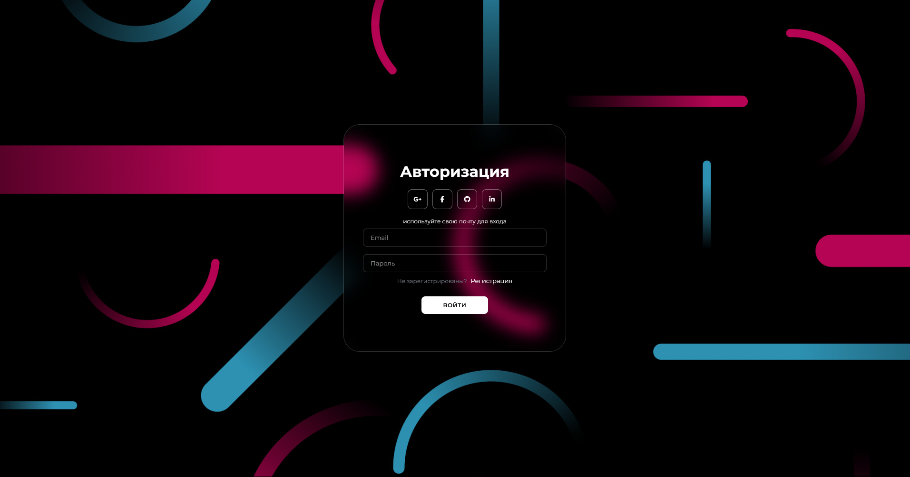

# 🚀 BlurAuth - Готовое решение для страниц регистрации и входа с эффектом размытия

**BlurAuth** – предоставляет 2 страницы регистрации и входа с эффектом размытия. Этот проект полностью построен на чистом CSS и HTML, предоставляя готовое решение для фронтенда ваших страниц авторизации.

## 🎨 Темы

BlurAuth поддерживает как **светлую**, так и **тёмную** темы. Ниже представлены их предварительные просмотры:

### Светлая тема

### Тёмная тема

## ✨ Особенности

- Полностью реализовано на чистом CSS и HTML.
- Готовое решение для страниц регистрации и входа.
- Эффект размытия, который добавляет современный стиль.
- Легкость в изменении темы и настроек через CSS.

## 🔧 Настройка

Вы можете легко изменить изображение фона, цветовую схему или другие стили, просто обновив соответствующие значения в CSS.